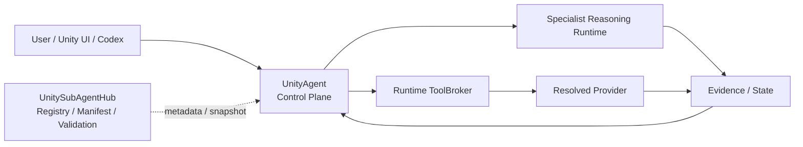

<h1 align="center">UnitySubAgentHub</h1>

<p align="center"><strong>Optional Specialist SubAgentsの Registry / Catalog / Manifest / Schema / Validation Hub。</strong></p>

<p align="center">
  <a href="https://github.com/DarumaPPAP/UnitySubAgentHub/actions/workflows/subagent-hub-contract.yml"></a>
  
  <a href="LICENSE"></a>
</p>

<p align="center">
  <a href="#role">Role</a> ·
  <a href="#system-position">System Position</a> ·
  <a href="#registry">Registry</a> ·
  <a href="#eligibility">Eligibility</a> ·
  <a href="#add-a-specialist">Add a Specialist</a> ·
  <a href="#branch-workflow">Branch Workflow</a> ·
  <a href="Design/subagent-hub-architecture.md">Architecture</a> ·
  <a href="docs/README.md">Docs Index</a> ·
  <a href="docs/references/unity-cli-reference.md">Unity CLI Reference</a>
</p>

> [!IMPORTANT]
> **UnityAgentが唯一のControl Planeです。** UnitySubAgentHubはRequest Resolver、Runtime、Orchestrator、Installerではありません。HubはOptional SubAgentのmetadataとvalidationを提供し、実行可否の判断と実行そのものはUnityAgentが担当します。

UnitySubAgentHub is a static registry and contract catalog for optional UnityAgent specialist SubAgents. It does not route user requests, execute specialist work, install capabilities, or own runtime orchestration.

## Role

UnitySubAgentHubは、Unity開発向けOptional Specialist SubAgentのIdentity、Lifecycle、Capability、Compatibility、Dependency、Backend、Evidence契約を登録・検証するmetadata Hubです。

| Does | Does Not |
|---|---|
| Registry Index | User request routing |
| Canonical SubAgent Manifest | Runtime execution |
| Shared Schema | Orchestration |
| Fail-Closed Validation | Automatic installation |
| Catalog Snapshot generation | Project / Environment state ownership |
| Lifecycle / Compatibility contract | Policy / Approval authority |
| Cross-reference validation | Backend dispatch / Retry / Fallback |

Registry登録は、installed / compatible / project-bound / available / eligible / executableを意味しません。すべてのSubAgentはOptionalです。

## System Position



Hubは実行経路のControl Planeではありません。Manifestは「候補になるための契約」を宣言し、現在のProject状態はUnityAgentがRuntimeで観測します。

## Core Rules

- **Optional by default** — SubAgent導入は必須ではありません。
- **No auto-install** — Capability解決のためにSubAgentを自動Installしません。
- **Manifest is canonical** — 各Specialistの正本は `SubAgents/<id>/manifest.yaml` です。
- **Fail-Closed** — 必須条件がfalse / unknown / unavailableなら候補から除外します。
- **Lifecycle before ranking** — 新しいCapability解決では `active` のSpecialistだけを対象にします。
- **Identity != Backend** — Specialist identityと実行Backend IDを分離します。
- **Hub != Runtime** — RegistryやSnapshot公開だけで実行可能になったとは扱いません。

## Registry

現在登録されているProduction Specialist:

| Specialist | Canonical ID | Backend / Provider ID | Lifecycle |
|---|---|---|---|
| ArtistSubAgent | `artist_subagent` | `unity_artist_cli` | `active` |
| GraphicsSubAgent | `graphics_subagent` | Reasoning、Tool Backendなし | `active` |
| WorldCreatorSubAgent | `world_creator_subagent` | Reasoning、Tool Backendなし | `active` |
| PerformanceSubAgent | `performance_subagent` | Reasoning、Tool Backendなし | `active` |

Graphicsは `project.inspect` / `source.read` をUnityAgent ToolBrokerで観測した後にReasoningします。WorldCreatorの `world.plan` はReasoning Runtimeで実行します。Performanceは `profiler.observe` の検証済み観測後にReasoningします。現在のUnity CLI / Pipeline経路は結合済みEditorの単一snapshotを `limited` として扱い、比較・回帰判定を許可しません。登録はProduction Verifiedを意味しません。

ArtistSubAgentは専門AgentのIdentityです。

- `artist_subagent` — Specialist identity
- `unity_artist_cli` — Current backend/provider ID
- `unity-artist` — Host CLI executable
- `com.darumappap.artist-subagent` — ArtistSubAgent Backend Unity Package ID

これらを同じIdentityとして扱いません。

Resolver-visible Capability:

- `artist.camera.inspect`
- `artist.camera.refine`
- `visual.capture`
- `graphics.inspect` / `graphics.diagnose` / `graphics.validate`（Reasoning）
- `world.plan`（Reasoning）
- `performance.analyze`（Reasoning、`profiler.observe` Observation必須）

Backend CLIの全コマンドやContractに存在する広い機能は、ManifestとUnityAgent Runtimeの両方で対応されるまでResolver候補ではありません。

## Manifest Contract

Canonical files:

| Concern | Canonical Source |
|---|---|
| Repository authority / mirrored declarations | `Specs/repository-authority-map.yaml` |
| Registry index | `Registry/subagents.yaml` |
| Specialist identity / lifecycle / capability / compatibility / backend / evidence | `SubAgents/<id>/manifest.yaml` |
| Registry / Manifest structure | `Schemas/` |
| Specialist-specific behavior / acceptance | Manifestが参照する `contracts/` |
| Architecture / addition rules | `Design/subagent-hub-architecture.md` |
| Resolution / execution policy | [UnityAgent](https://github.com/DarumaPPAP/UnityAgent) |

`Registry/subagents.yaml` はManifest PathのIndexです。環境固有のInstall状態やProject Bindingを保存しません。

## Eligibility

Manifestは必要なEnvironment factsとfalse / unknown時の除外契約を宣言します。UnityAgentが評価順序とRankingを決めます。

ArtistSubAgentのrequired activation gates:

- `unity_artist_cli.available`
- `unity_artist_cli.compatible`
- `unity_artist_cli.project_bound`
- `unity_artist_cli.package_installed`
- `unity_artist_cli.pipeline_reachable`

必須の環境事実がtrueでない場合、SpecialistはResolution候補から除外されます。条件を満たす候補がなければ `unavailable` を返します。

Installは別の明示的なSetup操作です。

## Compatibility

ArtistSubAgent Manifestが現在宣言するsupported targets:

| Unity | Render Pipeline |
|---|---|
| Unity 6.x+ | Built-in |
| Unity 6.x+ | URP |
| Unity 6.x+ | HDRP |

CompatibilityはManifestで宣言されますが、現在のProjectが実際に対応しているかはUnityAgentがEnvironment factsとして観測します。

## Snapshot Integration

Hub CIは登録されたManifestを検証し、consumer-neutral Snapshotを一時生成してSchema適合性まで確認します。Hub自身はSnapshotをRelease/配布しません。UnityAgent Releaseが固定Hub commitを取得し、同じExporterからRelease provenance用Snapshotを生成します。

SnapshotにTask Route、`goal_type`、`primary_capability`、既定Profile、現在のProject / Environment状態、選択済みProvider、実行時Evidence producerは含めません。

UnityAgent `main` は、現在Repository内の `Runtime/ReferenceImplementation/subagent-catalog.yaml` を読み込みます。Hub CI Artifactを自動取得・同期する経路は現行コードにはありません。

したがって、**Artifact公開 != UnityAgent Runtimeへ同期済み** です。UnityAgent側のOffline Import AdapterがSnapshotを検証し、UnityAgent所有のProfile値と照合してImport Planを作ります。HubとUnityAgentのContractを変更するときは両Repositoryで検証してください。Compatibility Factの生成・観測はUnityAgentのEnvironment discoveryが担当します。

## Add a Specialist

1. `Schemas/subagent-manifest.schema.json` に従って `SubAgents/<id>/manifest.yaml` を作成します。
2. Optional Install、`auto_install: false`、Lifecycle、false / unknown時のFail-Closed behaviorを定義します。
3. Required dependencyごとに `activation.required_before_resolution` のGateを定義します。
4. Resolver-visible Capability、supported Unity / Render Pipeline target pairs、Dependency、Backend、Evidence Contractを宣言します。
5. Manifest Pathだけを `Registry/subagents.yaml` へ登録します。
6. Hub validationを実行します。

```sh
python Tests/Hub/validate_repository_authority.py
python Tests/Hub/validate_registry.py
python -m unittest discover -s Tests/Hub -p 'test_*.py' -v
python Tests/Hub/export_agent_snapshot.py --output /tmp/subagent-catalog.yaml
```

Registryへの追加はdata-onlyです。新しいCapability semanticsを追加する場合は、UnityAgent Runtime側の対応も必要です。

## Specialist Guides

- [ArtistSubAgent](SubAgents/artist_subagent/README.md) — Provider-backed。Backendは `unity_artist_cli`
- [GraphicsSubAgent](SubAgents/graphics_subagent/README.md) — Read-only reasoning
- [WorldCreatorSubAgent](SubAgents/world_creator_subagent/README.md) — Planning-only reasoning
- [PerformanceSubAgent](SubAgents/performance_subagent/README.md) — Observation-backed read-only reasoning
- [Hub Architecture](Design/subagent-hub-architecture.md)
- [Migration from MyUnityMCP](MIGRATION_FROM_MYUNITYMCP.md)

各SpecialistのIdentity / Lifecycle / Capability / Execution kindの正本は対応する `manifest.yaml` です。Graphics / WorldCreator / Performance配下の旧 `capability-contracts.yaml` はPilot時点のbaselineを比較するために残されており、Current Production Contractではありません。Current Contractは各Manifestの `capability_contract_ref` が指す `production-capability-contract.yaml` です。

このRepositoryにはArtist backend implementationも移行互換性のため同居していますが、Hub Registry / Validator自身がそれをdispatch・executeするわけではありません。

## Branch Workflow

開発branchは `main` から作成し、`feature/*`、`fix/*`、`chore/*`、必要時のみ `release/*` を使用します。通常PRは `main` をbaseにし、Squash Merge後の短命branchは自動削除します。

詳細と機械可読な契約は [Branch Policy](docs/development/branch-policy.md) を参照してください。

## Validation

Hub contract:

```sh
python Tests/Hub/validate_registry.py
python -m unittest discover -s Tests/Hub -p 'test_*.py' -v
python Tests/Hub/export_agent_snapshot.py --output /tmp/subagent-catalog.yaml
```

GitHub Actionsでは `SubAgent Hub Contract` がRegistry、Manifest、Fail-Closed invariantを検証し、Snapshot Artifactを公開します。

## Legacy

`Legacy/MyUnityMCP-1.1.1/` は旧MCP Packageの移行記録です。現在のHub RuntimeでもArtistSubAgent Backendでもありません。公開済みLegacy Tagは変更しません。

## License

UnitySubAgentHubは [MIT License](LICENSE) で提供されます。

## Distribution

UnitySubAgentHubと個別SubAgentは独立Releaseを持ちません。Current sourceはこのRepositoryの`main`で管理し、公開時はUnityAgent Releaseが**固定commit SHA**をpinしてHub contractsを検証し、必要なArtist backend / package / SnapshotをUnityAgentのRelease Assetsへ同梱します。

Codex MarketplaceとGitHub Releaseの公開単位は`unity-agent`のみです。Hubの`main`を実行時に直接追従させず、公開済みUnityAgent Releaseの内容は固定されたHub commitから再現可能にします。
